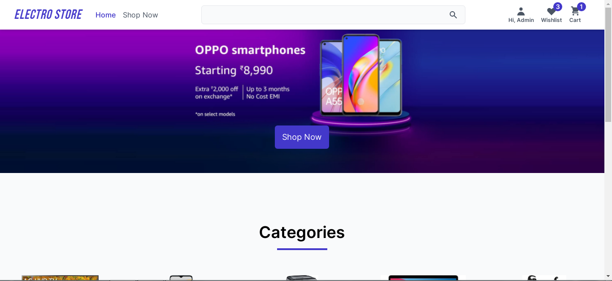

<p align="center">
   
</p>

# Tour App

[](https://github.com/imkousik9)
[](https://app.netlify.com/sites/electro-store-km/deploys)

Electro store is a E-commerce Application for electronics Products made with Reactjs and Expressjs

# Application Links

Frontend Code -> [https://github.com/imkousik9/electro-store](https://github.com/imkousik9/electro-store)
<br>
Backend Code -> [https://github.com/imkousik9/electroStore-backend](https://github.com/imkousik9/electroStore-backend)
<br>
Deployed URL -> [https://electro-store-km.netlify.app](https://electro-store-km.netlify.app)
<br>

**Run the site locally**

### Step 1: Clone The Repo

Fork the repository. then clone the repo locally by doing -

```bash
git clone https://github.com/imkousik9/electro-store.git
```

### Step 2: Install Dependencies

cd into the directory

```bash
cd electro-store
```

install all the dependencies

```bash
yarn
# or
npm install
```

### Step 3: Start Development Server

Then start the development Server

```bash
yarn dev
# or
npm run dev
```

After running the development server the site should be running on https://localhost:3000

# Tech Stack

<b>Frontend</b>: Reactjs, Redux Toolkit, React Router v6
<br>
<b>Backend</b>: Expressjs, mongodb, mongoose,
<br>
<b>Styling</b>: Tailwindcss
<br>
<b>Payment Getaway</b>: Razorpay
<br>
<b>Deployment</b>: netlify, cyclic
